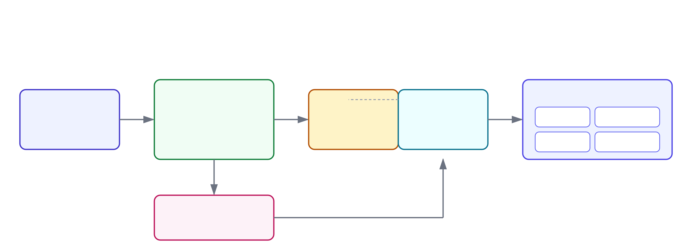

cat <<'EOF' > README.md
# GuardPipe App

A hardened, containerized REST API demonstrating a full DevSecOps CI/CD pipeline — from code commit to a security-scanned, production-style container image.

## Overview

This is the **application repository** in a two-repo GitOps setup. It contains the app code, Dockerfile, and CI pipeline. Deployment configuration lives in a separate repo: [guardpipe-gitops](https://github.com/pooja-dhawale16/guardpipe-gitops).

## Architecture



**Flow:** Code push → GitHub Actions builds the image → Trivy scans it for vulnerabilities → image is pushed to GitHub Container Registry (GHCR) → the deployment repo is updated → ArgoCD picks up the change and deploys it automatically.

## Tech stack

- **App:** Node.js + Express
- **Container:** Docker, multi-stage build, distroless final image
- **CI/CD:** GitHub Actions
- **Security scanning:** Trivy (image vulnerability scanning)
- **Registry:** GitHub Container Registry (GHCR)

## Why a distroless base image?

The initial build used `node:20-alpine`, which bundles the full npm toolchain into the final image — this surfaced 17+ CVEs in Trivy scans (mostly in npm's own dependencies like `tar`, `minimatch`, `glob`).

Switching the final stage to `gcr.io/distroless/nodejs20-debian12:nonroot`:
- Removed npm, shell, and package manager binaries from the runtime image entirely
- Cut the image size from ~120MB to ~46MB
- Reduced the vulnerability count to near-zero
- Runs as a non-root user by default, satisfying Kubernetes `runAsNonRoot` security policy

```dockerfile
FROM node:20-alpine AS build
WORKDIR /app
COPY app/package.json .
RUN npm install --production
COPY app/ .

FROM gcr.io/distroless/nodejs20-debian12:nonroot
WORKDIR /app
COPY --from=build /app /app
EXPOSE 3000
CMD ["server.js"]
```

## CI Pipeline

Every push to `main` triggers:
1. **Build** — Docker builds the image
2. **Scan** — Trivy scans for CRITICAL/HIGH vulnerabilities
3. **Push** — Image is pushed to `ghcr.io/pooja-dhawale16/guardpipe-app`


## Related repo

Deployment configuration and ArgoCD setup: [guardpipe-gitops](https://github.com/pooja-dhawale16/guardpipe-gitops)
EOF
